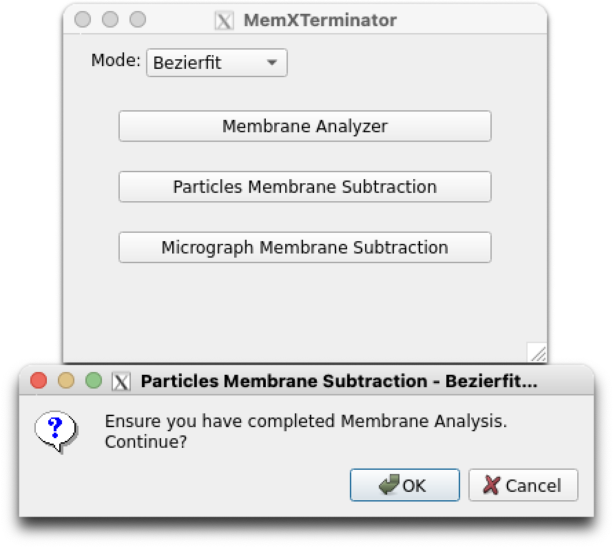
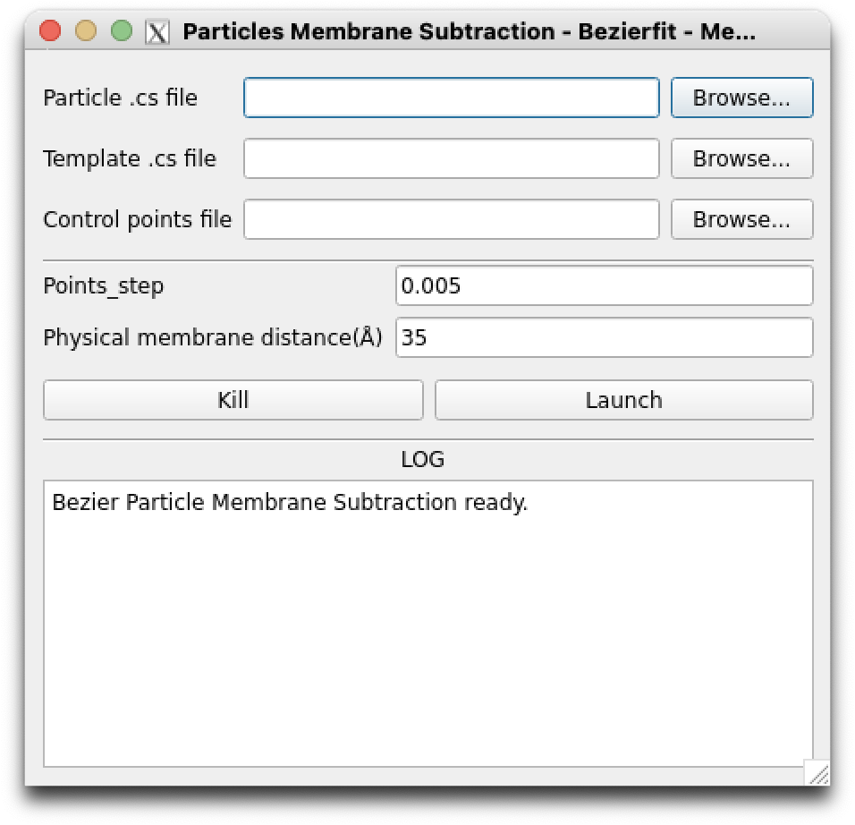

# Particles Membrane Subtraction Using Bezierfit

## 1 Basic Idea

After completing the previous step of Membrane Analysis Using Bezierfit, you have obtained `control_points` information for all 2D averages, which provides the mathematical models of the corresponding Bezier curves. In this step, you will use this information to subtract membrane signals from all particles.

* For each particle $F_{RawImage}(x,y)$ (abbreviated as $F_{RI}(x,y)$), based on its corresponding template $f_{2DAverage}(x,y)$, obtain its control_points information $(x'_n, y'_n)$;
* Using the alignment information from `cryoSPARC`, namely the `particles_selected.cs` file, determine the displacement $(\Delta x, \Delta y)$ and rotation angle $\psi$ for each particle. With this information, transform the control_points $(x'_n, y'_n)$ to obtain the corresponding control points $(x''_n, y''_n)$ and the Bezier curve $L_3$ for each particle's membrane signal;
* Based on the $L_3$, generate the corresponding membrane mask $F_{MembraneMask}(x,y)$ (abbreviated as $F_{MM}(x,y)$) and the averaged biological membrane within the mask $F_{AveragedMembrane}(x,y)$ (abbreviated as $F_{AM}(x,y)$);
* For each particle, to obtain $F_{SubtractedRawImage}(x,y)$ (abbreviated as $F_{SRI}(x,y)$), use the following equation:

$$
F_{SRI}(x,y) = F_{RI}(x,y) - \lambda \times F_{AM}(x,y)
$$

where $\lambda$ is a constant controlling the intensity of membrane subtraction. $\lambda$ is determined by:

$$
\lambda = \arg \min_{\lambda} || F_{RI}(x,y) \times F_{MM}(x,y) - \lambda \times F_{AM}(x,y) ||_1
$$

## 2 Specific Steps

### 2.1 Open the Interface

First, open the `MemXTerminator` main program, select the `Bezierfit` mode, then choose `Particles Membrane Subtraction`, and enter the Particles Membrane Subtraction interface:

{: .small}
Bezierfit Particles Membrane Subtraction interface

### 2.2 Set Appropriate Parameters

The Particles Membrane Subtraction interface is as follows:

{: .small}
Bezierfit Particles Membrane Subtraction main interface

You need to enter the following file paths:

* `Particle .cs file`: Select the `.cs` file that saves all particles information, usually `particles_selected.cs`;
* `Template .cs file`: Select the `.cs` file that contains all templates information, usually `templates_selected.cs`;
* `Control points JSON file`: Choose the JSON file containing all control_points information. This file contains control_points information for all templates, typically `control_points.json`;

You can set the following parameters:

* `Points_step`: As the Bezier curve is approximated using several points, you can set the interval between these points to control the precision of the generated Bezier curve. A smaller value will result in a more refined curve but increase computational load; a larger value may affect the results of Membrane Subtraction(DO NOT set it too large to avoid any artifacts). The default is 0.001;
* `Physical membrane distance`: Set the physical thickness of the biological membrane in Angstroms (Å). This parameter will be used to calculate the thickness of the mask for membrane averaging. It should be set based on actual conditions, generally between 35-40;

After setting the appropriate parameters, click `Launch` to begin the membrane subtraction.

!!! Note "How to resume from a breakpoint"
    Like Radonfit Particle Membrane Subtraction, if the job is interrupted for some reason, you can continue to do the membrane subtraction because every time you begin the membrane subtraction, the software will read the `bezfit_pms_run_data.log` file, which records the particle stacks that have been processed. The software will automatically skip the processed particle stacks and continue to process the remaining particle stacks.

## 3 Results

You will find a `subtracted` folder next to the folder where you extracted the particles, like this:

    Jxxx/
    ├── extract/
    ├── subtracted/

This folder contains all the `.mrc` files of the particles with membrane signals removed. You can proceed with further processing using `cryoSPARC` or put the particles back to the micrographs for subsequent processing.

!!! Warning
    Like Radonfit Particle Membrane Subtraction, please note that the software can only recognize the `extract` folder in the `Jxxx` folder, and usually in the `'blob/path'` column of the `particles_selected.cs` file.
