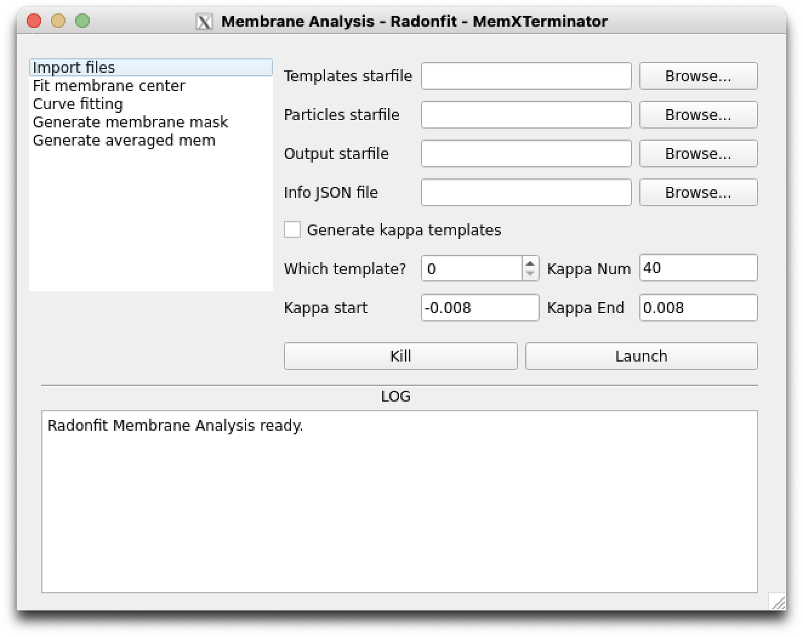

# Preprocessing

## Convert `.cs` to `.star` using pyem

Use `pyem`  `csparc2star.py` to run the following command, converting `particles_selected.cs` into `particles_selected.star`:

For the latest version of `pyem`, run the following command:

```bash

csparc2star.py --relion2 --inverty particles_selected.cs Jxxx_passthrough_particles_selected.cs particles_selected.star
```

!!! warning
    Please DO NOT miss `--inverty`!

If there is no relion2 parameter, it means your `pyem` version is older, run the following command:

```bash

csparc2star.py --swapxy particles_selected.cs Jxxx_passthrough_particles_selected.cs particles_selected.star
```

## Obtain 2D Averages

### 1 Principle and Approach

Use a series of biological membranes with different curvatures, all centered in the image, as templates to pick particles. The centers of the resulting particles will align with the centers of the biological membranes in the micrographs. Then, perform 2D classification on these particles to obtain 2D averages with the membrane center at the image center.

The advantage of this approach is that it simplifies and increases the accuracy of subsequent membrane analysis and fitting.

### 2 Specific Procedure

#### 2.1 Obtaining 2D Averages in cryoSPARC

First, we need to obtain a 2D average in cryoSPARC, where the biological membrane signal is strong and the signal-to-noise ratio is high. As our method aims to weaken the membrane signal, it should not be difficult to find such a 2D average.

{: .small}
<span class="caption">A typical biological membrane 2D average, choose the first one for analysis</span>

For example, we choose the first 2D average in the above image for analysis. For convenience in cryoSPARC, when selecting 2D Classes, we only need to choose this one 2D average.

#### 2.2 Using GUI for Radon Analysis Blinking
Open the main program of MemXTerminator and enter the Radon Analysis Blinking interface:

{: .small}
<span class="caption">Radon Analysis Blinking Interface</span>

* Select the mrc file of the 2D average obtained in the previous step with Select 2D Classes;
* Select section 0 (or the section corresponding to your 2D average, starting from 0);
* Choose an appropriate crop rate and threshold;
* Click Start Radon Analysis. After the analysis is completed, a window will pop up showing the results of the Radon transformation. If you see the positioning of the two red crosses is accurate (usually the same horizontal coordinate and a vertical interval equal to the distance of the biological membrane), it indicates a successful analysis. Close the window. If the positioning of the two red crosses is inaccurate, please readjust the crop rate and threshold and click Start Radon Analysis again until the positioning of the two red crosses is accurate;

    {: .small}
    <span class="caption">Successful Radon Analysis Example</span>

* After analyzing this mrc file, choose a path to save the JSON file with these parameters and then save them.

#### 2.3 Generating a Series of 2D Average Templates with the Membrane Center at the Image Center
Open the main program of MemXTerminator and enter the Membrane Analyzer interface:
    {: .small}
    <span class="caption">Membrane Analyzer Interface</span>

* Check Generate kappa templates;
* Which template? Choose which section to use as a reference to generate 2D average templates. By default, choose 0, i.e., the first particle in this stack as a reference;
* Kappa Num: Choose how many different curvature 2D average templates you need to generate. The default is 40.
* Kappa start and Kappa end: Choose the curvature range of the 2D average templates you need to generate. The default range is -0.008 to 0.008. Do not make this range too large, as the actual curvature of biological membranes is not very large.
* Fill in the file paths for other files, including `Templates starfile`, `Particles starfile`, etc.
* Click Launch to run the program.

You will obtain the following 2D averages templates:

{: .small}
<span class="caption">Generated 2D Average Templates</span>

#### 2.4 Picking Particles Using the Generated 2D Average Templates

* In cryoSPARC, select Import Templates and import the mrc files of the 2D average templates generated in the previous step;
* Select Template Picker, choose the 2D average templates you just imported, choose the micrographs you want to pick particles from, and run the program;
* The centers of the resulting particles will align with the centers of the biological membranes in the micrographs.

    {: .small}
    <span class="caption">Particles picked using cryoSPARC</span>

* Proceed with Inspect Picks, Extract Mics., and 2D Class in sequence to obtain several 2D averages, all of which have the membrane center at the image center.

    {: .small}
    <span class="caption">Obtained 2D Averages</span>

!!! note
    When completing 2D Classification and selecting 2D averages, do not choose those where the membrane signal is not dominant. This is because, on one hand, the membrane subtraction effect on these types of particles is not the best, and on the other hand, the membrane signal is not very clear in the 2D averages of these types of particles. When choosing Radonfit for subsequent membrane analysis, there may be some issues.

### 3 Results

Through the above steps, we can obtain a series of 2D averages with the biological membrane center at the image center. These 2D averages can be used for subsequent membrane analysis.